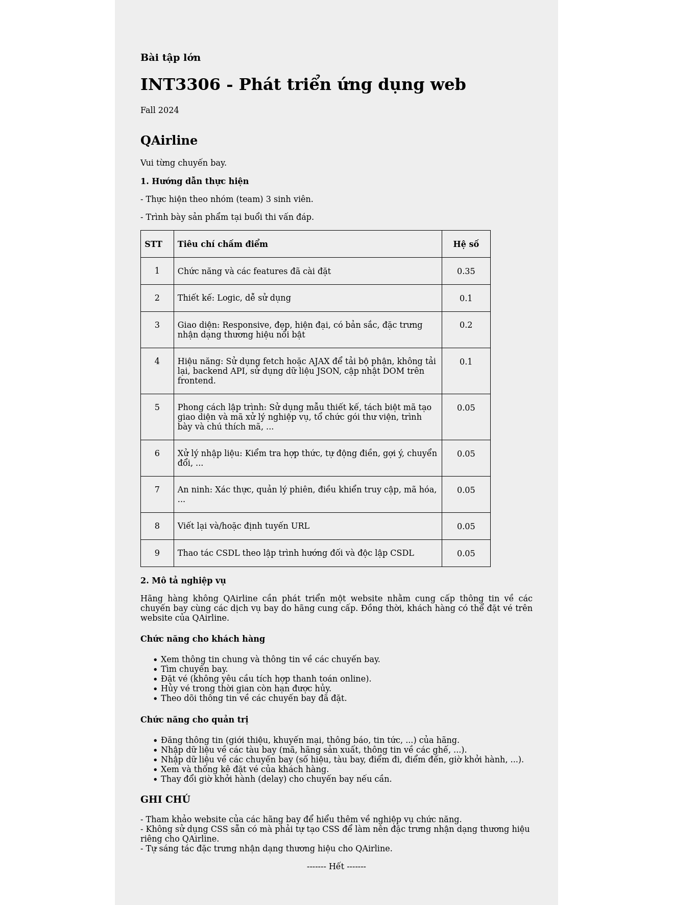

# QAirLine-Web-Development
_Last update: 22-12-2024_

---
## Các thành viên trong nhóm:
- Nguyễn Thị Ngọc Mai - 22025510
- Phạm Xuân Dương - 22025518
- Trần Khánh Duy - 22025520

## Tiêu chí chấm điểm

## Links Doc:
- **Documentation:** [Google Docs](https://docs.google.com/document/d/1nODdki0r2RcgPhPUG_MXHBd9q2NtNPuFjhOxfeeOByA/edit?tab=t.jlgsr1vlsu89)
- **Design:** [Figma](https://www.figma.com/design/JBdIUuN0Iz0ycq0D8HXC3C/WebDev-Airlines?node-id=1-6&p=f&t=F0wNqFaOixcfIrSt-0)

### Phân công công việc chi tiết:
#### 1. Mai - Frontend phần khách hàng
- **Giao diện người dùng:**
  - Thiết kế và phát triển các trang chính: Trang chủ, tìm kiếm chuyến bay, đặt vé, và thanh toán.
  - Tối ưu trải nghiệm người dùng trên thiết bị di động và máy tính.
- **Tính năng khách hàng:**
  - Tạo form tìm kiếm chuyến bay với các bộ lọc linh hoạt.
  - Hiển thị thông tin chuyến bay và giá vé theo thời gian thực.
  - Xây dựng quy trình đặt vé và xác nhận thanh toán.
- **Tích hợp API:**
  - Phụ trách phát triển phần xác thực người dùng cho bên Khách hàng và Quản trị viên.
  - Kết nối API từ backend để lấy thông tin chuyến bay, giá vé, và đặt chỗ.
  - Xử lý thông báo lỗi và thông báo trạng thái đặt vé.
- **Kiểm thử và triển khai:**
  - Đảm bảo tương thích trên các trình duyệt phổ biến và thiết bị khác nhau.
  - Hỗ trợ triển khai hệ thống lên Docker.
  - Đảm bảo tính chính xác và bảo mật cho các chức năng bên Khách hàng.

#### 2. Dương - Frontend phần quản trị viên
- **Giao diện người dùng và quản trị:**
  - Xây dựng trang đăng nhập và xác thực quyền truy cập.
  - Phát triển giao diện quản lý chuyến bay, khách hàng, và đặt vé.
  - Hỗ trợ thiết kế và phát triển các trang bên Khách hàng: Đăng nhập, đăng ký, khuyến mãi.
- **Tính năng quản trị:**
  - Cho phép thêm, sửa, xóa thông tin chuyến bay.
  - Quản lý danh sách đặt vé, bao gồm trạng thái và lịch sử đặt vé.
  - Tạo báo cáo thống kê doanh thu, số lượng khách hàng và chuyến bay.
  - Gửi email thông báo khách hàng các thay đổi về chuyến bay.
- **Tích hợp API:**
  - Gửi và nhận dữ liệu từ backend để hiển thị và xử lý thông tin.
  - Xử lý thông báo lỗi và xác thực dữ liệu.
- **Kiểm thử giao diện và bảo mật:**
  - Đảm bảo tính chính xác và bảo mật cho các chức năng quản trị.

#### 3. Duy - Backend, phát triển API, thiết kế cơ sở dữ liệu
- **Thiết kế cơ sở dữ liệu:**
  - Xác định cấu trúc bảng với các khóa dữ liệu.
  - Xây dựng quan hệ giữa các bảng để tối ưu hóa truy vấn.
  - Thiết kế các trường mốc thời gian để theo dõi và quản lý dữ liệu trong các bảng.
- **Phát triển API:**
  - Tạo API RESTful cho các chức năng chính như tìm kiếm chuyến bay, đặt vé, thanh toán, và quản lý chuyến bay.
  - Xác thực người dùng và phân quyền giữa khách hàng và quản trị viên.
  - Tối ưu hiệu suất API và xử lý lỗi.
- **Kiểm thử và triển khai:**
  - Viết unit test và test tích hợp bằng Postman để kiểm tra logic API.
  - Triển khai hệ thống lên Amazon Web Service.

---
## Hướng dẫn chạy:
Vào thư mục gốc, chạy lệnh "docker-compose up -d"

---
## Git Branch
- `main`
- `develop`: Làm gì trên backend thì pull nhánh này.
- `front-end`: Làm gì trên frontend thì pull nhánh này.
- `frontend/...`: Nhánh con của front-end.

---

## Git Flow
*Lưu ý: Nếu muốn merge code lên develop phải thông báo lên nhóm.*
1. **Clone repo về máy:** `git clone`
2. **Chuyển sang nhánh develop:** `git checkout develop`
3. **Cập nhật thay đổi:** `git fetch` hoặc `git pull`
   - Lưu ý làm trước khi tạo branch mới.
4. **Tạo branch mới:** `git checkout -b [Tên nhánh temp mới]`
   - Tên nhánh mặc định sẽ là `feature/...`. VD: `feature/api-server`.
5. **Code trên nhánh vừa tạo.**
6. **Add các thay đổi:** `git add .`
7. **Commit:** `git commit -m "message"`
8. **Đẩy nhánh temp lên GitHub:** `git push origin [Tên nhánh]`
9. **Tạo pull request.**
